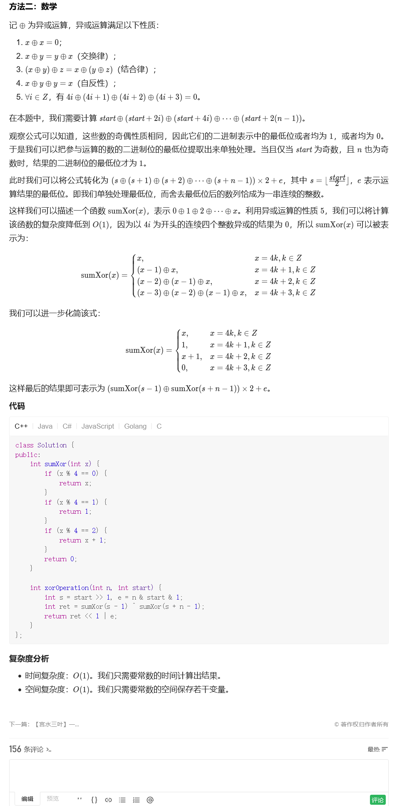

### 数组异或操作

给你两个整数，n 和 start 。

数组 nums 定义为：nums[i] = start + 2*i（下标从 0 开始）且 n == nums.length 。

请返回 nums 中所有元素按位异或（XOR）后得到的结果。

#### 示例1
```
输入：n = 5, start = 0
输出：8
解释：数组 nums 为 [0, 2, 4, 6, 8]，其中 (0 ^ 2 ^ 4 ^ 6 ^ 8) = 8 。
     "^" 为按位异或 XOR 运算符。
```

#### 示例2

````
输入：n = 4, start = 3
输出：8
解释：数组 nums 为 [3, 5, 7, 9]，其中 (3 ^ 5 ^ 7 ^ 9) = 8.
````

#### 示例3

```
输入：n = 1, start = 7
输出：7
```

#### 示例4

```
输入：n = 10, start = 5
输出：2
```

#### 提示

* 1 <= n <= 1000 
* 0 <= start <= 1000
* n == nums.length


#### 题解

由于第一种较简单这里不在赘述

#### 第二种

